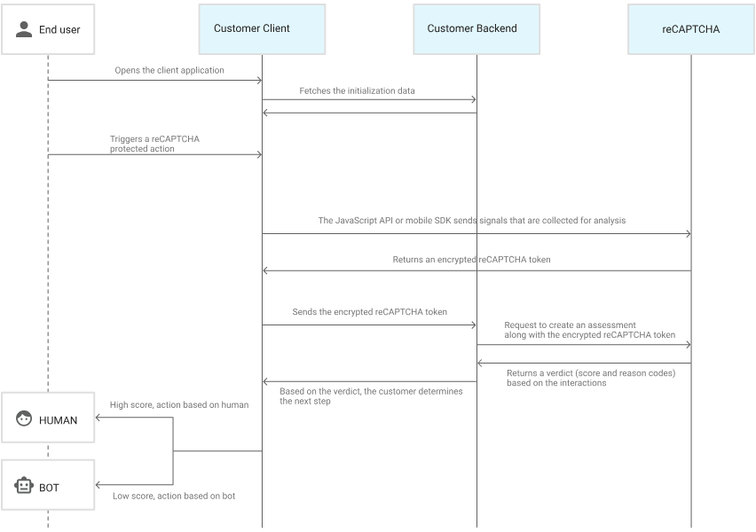

# reCAPTCHA

- Utilizes advanced risk analysis techniques to detect fraud.
- protect your websites or mobile applications from fraudulent activities and security risks such as:
  - Spam.
  - Abuse.
  - Credential stuffing[^1].
  - Account takeover (ATO).
  - Automated account creation.
  - Password breach.
  - Leak detection.
- It has:
  - Mobile app SDKs.
  - Multi-factor authentication (MFA).
- It interacts with your:
  - Backend.
  - Clients (web pages or mobile applications).

## UX -- User journey

1. Client loads the web page.
2. **Client app** initializes the reCAPTCHA JS API or mobile SDK.
3. End user triggers an action protected by reCAPTCHA (e.g. login), the reCAPTCHA JS API or the mobile SDK **in the client** requests a verdict[^2] from reCAPTCHA.
4. Get back an encrypted reCAPTCHA token (save it somewhere since we're gonna need it).
5. Client sends the aforementioned token to backend.
6. Backend sends an assessment req to reCAPTCHA + encrypted token.
7. Backend receives a verdict score from ranging 0 to 1 + a reason code based on this request made to the backend.
8. Now you can decide to reject the req or process it.

## To which layers we can add reCAPTCHA

- On websites.
- On mobile apps.
- On the [WAF layer](https://github.com/kasir-barati/paas-system/tree/cloud-practitioner/aws/WAF#waf--shield).

## How to work with Google's reCAPTCHA

1. Create a new project or use an existing one.
2. Enable the "reCAPTCHA Enterprise API".
3. Create a new "reCAPTCHA key" there by going to "reCAPTCHA" tab.

   1. Pick a name for the key.
   2. Choose your platform, in my case "Website".
   3. Add your domain name, no port number, or protocol is allowed.

      > [!TIP]
      >
      > If you're like me and want to just test it you can write: `localhost` or `127.0.0.1`, or you can add both :).

4. Add the script tag in the key details page, "Integration" tag to your web app.

   > [!NOTE]
   >
   > It is normal for your client to be able to see your reCAPTCHA key in plain text So do not worry about it. It is not supposed to be a secret ;).

5. Call the `grecaptcha.execute` function on whatever action you want to protect. In my case on clicking on "Sign up!" button.

   I do not like to have bots as user :kidding:. Anyway here is a break down on what you need to do:

   1. I created my registration form. It is called [`register.html`](../../frontend/register.html) and made the most beautiful UI.
      > [!IMPORTANT]
      >
      > The most important part is where I added a hidden `input`. That's how I am sending the token I got from Google reCAPTCHA service to my backend.
   2. I wrote all the logics that I were not able to implement in htmx in what they call it hypermedia friendly in a separate JS file called [`register.js`](../../frontend/register.js) and linked it to my html file.
      1. There we have a function called `isGoogleRecaptchaReady` which is responsible to check whether the Google's lib for reCAPTCHA is loaded. I just promisified it for the sake of syntax.
      2. I realized that there are a couple of ways to modify a request before sending it:
         1. Through: `hx-on:htmx:config-request` attribute. But as you can see it is designed for simple scenarios and not for cases like our case where we need more room to work (learn more [here](https://htmx.org/docs/#the-hx-on-attributes)).
         2. `hx-sync` which looked it might be able to help me in one way or another but the more I looked at it the more I realized that it was not up to the task. You can have more complex logic in it but it won't wait until it is resolved and then make the forms request ([learn more in their doc](https://htmx.org/docs/#synchronization)).
         

           

             <b>So here is what I was trying to do with it but could not.</b>
           

           
I added an <code>hx-click</code> <small>(in fact I tried first <code>onclick</code> but they where not any different)</small>. And inside that handler I tried to do the logic that I've implemented in step 3.

         

         3. I then saw my savior, `htmx:confirm` event. This was what worked an was able to handle this task.
      3. I defined a listener for `htmx:confirm` event and inside it:
         1. Made sure that we've intercepted the right event, the one that user is trying to register -- `isRegisterForm`.
         2. Then made sure Google's lib is ready -- `isGoogleRecaptchaReady`.
         3. Called Google's API with our site key to get a token for this request: `grecaptcha.enterprise.execute`.
         4. Then updated our hidden input with the fetched value from Google.
            > [!CAUTION]
            >
            > Here my hidden `input` did not have any `hx-*` attribute on it. Thus I did not need to tell htmx anything about me changing the DOM with JS. But if you have please note that:
            >
            > > If javascript adds content to the DOM that has htmx attributes on it, you need to make sure that this content is initialized with the `htmx.process()` function.
            > >
            > > &mdash; [Ref](https://htmx.org/docs/#3rd-party).
         5. Told htmx to send the req: `event.detail.issueRequest`.

6. Add reCAPTCHA to [your backend](../../backend/src/routes/user.route.js):

   1. I have created a utility function called `createAssessment`, in it we are:

      > [!CAUTION]
      >
      > You need to either send your API key for authentication or can use a simpler approach called [ADC](https://cloud.google.com/docs/authentication/provide-credentials-adc) which stands for **A**pplication **D**efault **C**redentials. And here I decided to use API keys. But you can definitely go with what suits you're requirements most.
      >
      > On a side note, not every API can be called with API keys. But we know for sure that create assessment can be called based on what is written [here](https://cloud.google.com/recaptcha/docs/authentication#api-keys). And to learn about how you can create a new API key read [this doc](https://cloud.google.com/docs/authentication/api-keys).

      1. Creating a client -- `new RecaptchaEnterpriseServiceClient()`.
      2. Constructing our request -- `projectPath`, and `request` variables.
      3. Sending the req to get a score for the user action -- `client.createAssessment`.
      4. Performing some verifications before returning the `score` -- `isTokenValid`, `isTheExpectedAction`, and `isNumeric`.
      5. Lastly we are closing the open connection we've created just a few steps ago (step #1).
         > [!NOTE]
         >
         > Please read the JSDoc I wrote for the client [here](../../backend/src/utils/recaptcha.util.js).

   2. Then I use it to get a score assessment from Google.
   3. And finally I do a quick interpretation of the score and decide whether the action was performed by a human or a bot -- `isBot`.

Congrats, now you have a fully functional reCAPTCHA implementation in htmx, and your backend does not really mater since their logic is what they should take care of it. But here we used the lovely ExpressJS.

## YouTube

https://youtu.be/5gjeqTAn2vY

## Footnotes

[^1]: **Credential stuffing**: when the attacker collects stolen account credentials.
[^2]: **Verdict**: An opinion/decision made after judging the facts that are given.
